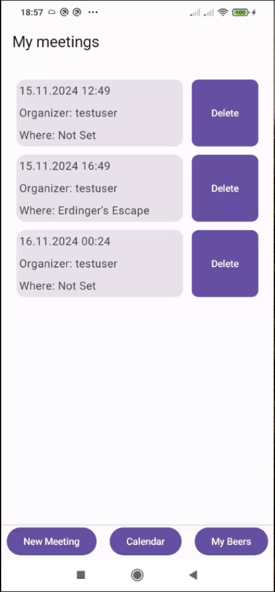
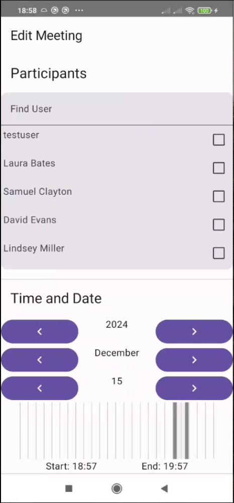
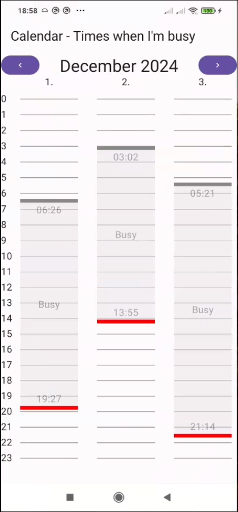

#  Pubfinder Meeting Planner

Plan meetings - in pubs!

##  About

This is a Kotlin/Jetpack compose frontend for the pubfinder app. It allows users to plan meetings, automatically find the best time for every participant and then finds them a pub to plan a meeting in. Pubs are selected accoording to the beers on tap and their ratings by the meeting participants. The meetings are displayed on a comprehensive calendar screen, which also allows easy editing.

---

| Meetings Screen | Meeting Editor | Calendar |
|----------|----------|----------|
|  |  |  |

---
